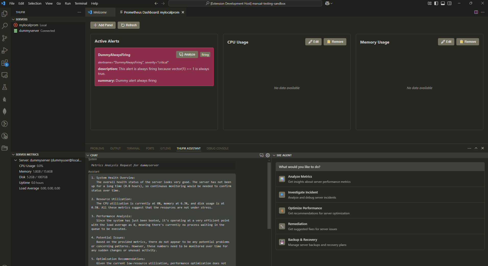

Thufir is an open-source VS Code extension that brings powerful Site Reliability Engineering (SRE) capabilities right into your development environment. By combining server management, monitoring, log analysis, and AI-powered insights, Thufir helps developers and SREs maintain reliable systems more efficiently.

## Features

## 🚀 Key Features

### 🖥️ Comprehensive Server Management
- **Multi-Server Support**: Manage multiple servers through secure SSH connections
- **Real-Time Monitoring**: Track essential server metrics:
  - CPU & Memory utilization
  - Disk usage statistics
  - System uptime
  - Load averages
  - Network performance

### 📊 Advanced Log Analysis
- **Real-Time Log Streaming**: Watch your server logs in real-time
- **Smart Filtering**: Filter logs by level (INFO, WARN, ERROR, DEBUG)
- **Pattern Detection**: AI-powered analysis to identify:
  - Common patterns and trends
  - Anomalies and potential issues
  - Root cause indicators
- **Actionable Insights**: Get AI-generated recommendations for addressing identified issues

### 📈 Prometheus Integration
- **Flexible Connectivity**: Connect to both local and remote Prometheus instances
- **Rich Visualization**: View and analyze Prometheus metrics directly in VS Code
- **Alert Management**: Monitor and analyze Prometheus alerts
- **Custom Metrics**: Track your application-specific metrics

### 🤖 AI Assistant
- **Quick Access**: Open with Ctrl+T (Cmd+T on macOS)
- **Multiple LLM Providers**:
  - OpenAI (GPT-4, GPT-3.5)
  - Anthropic (Claude 3)
  - Google (Gemini Pro)
- **Smart Analysis**:
  - Server metrics interpretation
  - Log pattern analysis
  - Alert investigation
  - Performance optimization suggestions

### 🛠️ SRE Agent
- **Performance Analysis**: Deep insights into system performance
- **Incident Investigation**: AI-assisted troubleshooting
- **System Optimization**: Get actionable recommendations for:
  - Performance improvements
  - Resource utilization
  - Configuration optimization
- **Proactive Planning**: Backup and recovery strategies

## 🎯 Who Is It For?

- **Developers** who need to monitor and maintain their deployment environments
- **SREs** looking for an integrated tool for server management and monitoring
- **DevOps Engineers** who want AI-powered insights for system optimization
- **System Administrators** managing multiple servers and applications

## 🚀 Getting Started

1. Install Thufir from the VS Code Marketplace
2. Add your first server using the Server Explorer view
3. Configure your preferred AI provider (OpenAI, Anthropic, or Google)
4. Start monitoring your servers and getting AI-powered insights!

## 📚 Documentation

For detailed documentation and examples, visit our [GitHub Wiki](https://github.com/thufir-dev/thufir/wiki).

## 🤝 Contributing

We welcome contributions! Please check our [Contributing Guidelines](CONTRIBUTING.md) for details on how to get started.

## 📄 License

This project is licensed under the GNU General Public License - see the [LICENSE](LICENSE) file for details.

## Author

This project is originally written and maintained currently by Evangelos Meklis.